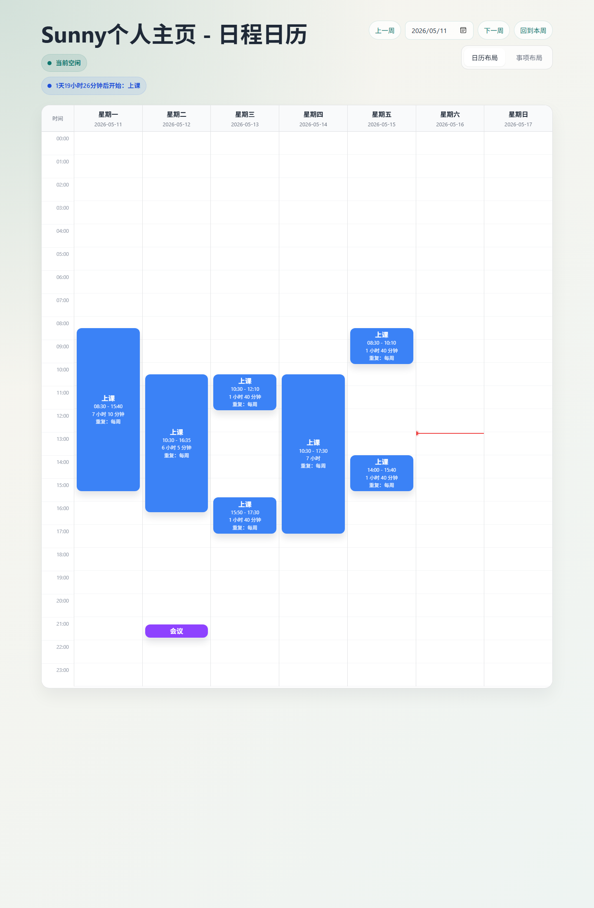

# 📅 日程日历

提供前台日历页面、控制台事项管理、编辑器日程卡片，以及面向 Halo 主题和自定义前端的日程数据能力。

<p align="center">
  
</p>

<p align="center">
  <a href="https://github.com/sunnyhmz7010/halo-plugin-schedule-calendar/releases"></a>
  <a href="https://github.com/sunnyhmz7010/halo-plugin-schedule-calendar/blob/main/LICENSE"></a>
  <a href="https://github.com/sunnyhmz7010/halo-plugin-schedule-calendar/actions/workflows/ci.yaml"></a>
  = 2.23.0" />
  
  
</p>

<p align="center">
  <a href="https://sunnyhmz.top/schedule-calendar">在线预览</a> ·
  <a href="https://github.com/sunnyhmz7010/halo-plugin-schedule-calendar/releases">下载发布包</a> ·
  <a href="https://github.com/sunnyhmz7010/halo-plugin-schedule-calendar/issues">反馈问题</a>
</p>



## ✨ 为什么做这个插件

Halo 站点里常见的时间表需求，往往要在主题模板、页面模块、后台维护和文章内容之间来回拼装。这个插件把这些能力收在一个地方：

- 访客可以直接访问公开周历页面。
- 管理员可以在控制台维护事项、循环规则和展示设置。
- 编辑器可以插入单个事项卡片，不用手写时间信息。
- 主题和自定义前端可以通过 Finder 或 REST API 读取同一份日程数据。

## 🚀 核心能力

### 🌐 前台公开页面

- 提供公开页面路由 `GET /schedule-calendar`
- 提供单事项卡片页 `GET /schedule-calendar/cards/{name}`
- 支持周视图、事项视图、当前状态、下一个事项倒计时和当前时间线提示

### 🛠️ 控制台事项管理

- 提供事项新增、编辑、删除
- 支持每日、每周、每月等循环规则
- 支持只读/管理权限区分
- 支持插件设置与事项数据的备份导出、导入恢复

### 🧩 编辑器日程卡片

- 在文章内容中插入已有事项
- 自动展示事项时间、地点、说明和循环摘要
- 适合做课程表、活动安排、预约说明、固定栏目时间卡片

### 🔌 主题与自定义前端集成

- 内置 `scheduleCalendarFinder`
- 提供公开 REST API
- Finder 和 REST 返回的数据围绕同一套周视图、摘要和事项模型组织

## ⚡ 快速开始

### 📋 运行要求

- Halo `>= 2.23.0`
- JDK `21`

### 📦 安装

1. 从 [Releases](https://github.com/sunnyhmz7010/halo-plugin-schedule-calendar/releases) 下载插件 `jar`
2. 在 Halo 控制台安装插件
3. 启用后访问 `/schedule-calendar`
4. 打开控制台中的“日程日历”开始维护事项

### 💡 适合的使用场景

- 个人主页课程表
- 博客固定更新日程
- 社群活动排期
- 工作室预约时间表
- 主题首页的“当前正在进行”和“接下来要做什么”模块

## 📖 使用方式

### 1. 🌍 公开页面

插件启用后即可访问：

```text
/schedule-calendar
```

如果要嵌入单个事项卡片，可使用：

```text
/schedule-calendar/cards/{name}
```

### 2. 🔎 主题 Finder

主题模板可直接使用以下 Finder：

- `scheduleCalendarFinder.week(start)`
- `scheduleCalendarFinder.summary()`
- `scheduleCalendarFinder.day(date)`
- `scheduleCalendarFinder.range(start, end)`
- `scheduleCalendarFinder.upcoming(limit)`
- `scheduleCalendarFinder.get(name)`
- `scheduleCalendarFinder.listAll()`

示例：

```html
<div th:with="week=${scheduleCalendarFinder.week('2026-04-01')}">
  <div th:text="${week.weekStart}"></div>
  <div th:text="${week.summary.current.text}"></div>
</div>

<div th:each="item : ${scheduleCalendarFinder.upcoming(5)}">
  <span th:text="${item.title}"></span>
  <time th:text="${item.startTime}"></time>
</div>

<div th:with="summary=${scheduleCalendarFinder.summary()}">
  <span th:text="${summary.next.text}"></span>
</div>
```

Finder 适合直接在 Halo 主题中读取：

- 当前周完整周视图
- 当前状态与下一个事项摘要
- 指定日期的时间块
- 指定区间内展开后的事项发生记录
- 单事项卡片或全量事项列表

### 3. 📡 REST API

如果你更习惯在主题外部、独立前端或脚本里消费 JSON，可使用这些公开接口：

```text
GET /apis/api.schedule.calendar.sunny.dev/v1alpha1/weeks?start=2026-04-01
GET /apis/api.schedule.calendar.sunny.dev/v1alpha1/summary
GET /apis/api.schedule.calendar.sunny.dev/v1alpha1/days?date=2026-04-01
GET /apis/api.schedule.calendar.sunny.dev/v1alpha1/occurrences?start=2026-04-01&end=2026-04-07
GET /apis/api.schedule.calendar.sunny.dev/v1alpha1/upcoming?limit=10
GET /apis/api.schedule.calendar.sunny.dev/v1alpha1/entrycards
GET /apis/api.schedule.calendar.sunny.dev/v1alpha1/entrycards/{name}
```

其中：

- `weeks` 返回周视图，并附带 `serverTime`、`zoneId`、`summary`
- `summary` 返回当前状态和下一个事项摘要
- `days` 返回单日占用时间块与空闲时间块
- `occurrences` 返回区间内展开后的实际发生记录
- `upcoming` 返回未来事项
- `entrycards` 返回基础事项卡片数据

## 🧠 功能细节

### 🗓️ 周历体验

- 周视图和事项视图可切换
- 会根据服务端时间计算当前状态
- 会显示下一个事项距离开始还有多久
- 会在当天列中标出当前时间线

### 📝 事项模型

- 支持标题、时间、地点、说明
- 支持循环频率、循环间隔、截止日期
- 循环事项会在周视图、区间查询和未来事项列表中按真实发生时间展开

### 🔐 权限与维护

- 匿名访客可访问公开页面和公开 API
- 控制台支持查看权限与管理权限区分
- 管理权限可进行新增、编辑、删除、备份和恢复

## 👨‍💻 本地开发

### 🧰 环境

- JDK `21+`
- Node `20+`
- pnpm `9`

### 🔨 构建插件

```bash
./gradlew.bat build
```

构建产物默认输出到：

```text
build/libs
```

### 🎨 前端开发

```bash
cd ui
pnpm install
pnpm build
pnpm test:unit
```

## ✅ 测试覆盖

仓库内已包含以下方向的测试：

- 周视图与循环事项展开
- 摘要信息与下一事项计算
- 单事项卡片输出
- 备份导出与恢复逻辑
- 前端循环规则工具函数

## 🔗 项目链接

- 在线演示：<https://sunnyhmz.top/schedule-calendar>
- 仓库地址：<https://github.com/sunnyhmz7010/halo-plugin-schedule-calendar>
- 问题反馈：<https://github.com/sunnyhmz7010/halo-plugin-schedule-calendar/issues>
- License：`GPL-3.0`
